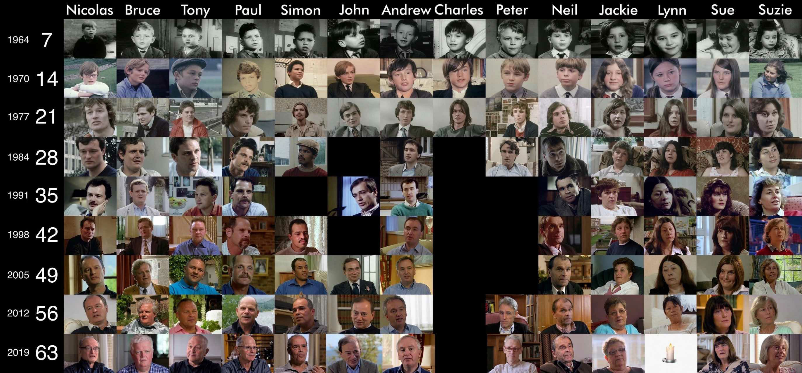

## 简述

英国有一句谚语

> **Give me a child until he is seven, and I will give you the man**

翻译过来是**给我一个七岁的孩子,我会让你看到成为成年人的他**，意思就是从一个孩子七岁时的表现，就能看出长大后乃至一生的成就。

 或许是这句话带来的灵感 ， 1964年，一位名叫**迈克尔·艾普特**的导演大胆决定拍摄一部**跨度最长的纪录片**。  他采访了14个来自英国不同阶层的孩子，他们有的来自孤儿院，有的来自普通的工人阶级，有的享受上层优渥的生活。记录从他们7岁开始，并每隔7年再追踪一次，记录他们在不同人生阶段，各自不同的人生状态，不同的人生选择和不同的人生轨迹 。

至今已拍摄到63岁（2020），令人遗憾的是，导演迈克尔·艾普特在2021年去世了，意味着我们可能再也看不到新的一集了，不过庆幸的是，现在已经有其他国家的《人生七年》了，以及21世纪的英国版《人生七年》。

## 详细介绍

我主要想表达的不在这里，所以，为了省时间，我直接摘抄知乎的高赞回答，并加以补充，已注明出处。

>  [大家看过纪录片《人生七年》后有什么感想？ - Allen9527的回答 - 知乎](https://www.zhihu.com/question/23665922/answer/936344989 ) 

### 一、精英上流社会

John约翰、 Andrew 安德鲁、Charles查尔斯、Suzy苏姿

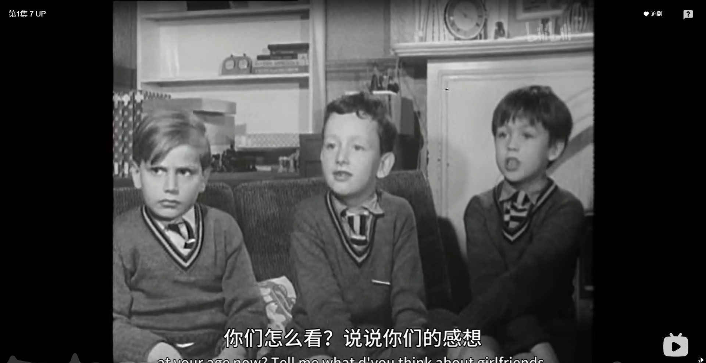

**John约翰(男，左一)**

 7岁：富家子弟，上贵族私人学校，7岁就看《[观察家](https://www.zhihu.com/search?q=观察家&search_source=Entity&hybrid_search_source=Entity&hybrid_search_extra={"sourceType"%3A"answer"%2C"sourceId"%3A936344989})》《泰晤士报》，计划着上剑桥大学三一学堂（传统强项是法学），想好了以后要从事法律。 

 14岁：导演问他有没有远大的志向，John的回答非常肯定，为了名誉和权利，他想从政。

21岁：如愿考上了剑桥大学，读法律专业。

28岁：未参加节目录制。

35岁：35岁结婚，娶了保加利亚前大使的女儿，John的家族与保加利亚有很深的渊源。在伦敦和乡下各有一套房子，休闲时打理下庭前的花花草草，弹弹琴。

42岁：未参加节目录制。

49岁：孩子已长大，自己和妻子陆续在做慈善事业，帮助保加利亚的困难儿童。

56岁：仍在法院工作，做诉讼，觉得自己的工作挺有趣。同时继续在做慈善事业，帮助困难儿童。非常享受自己的工作，享受那份为别人付出所带来的满足感。他认为自己一生中最成功的是拥有一群好朋友， 一段幸福美满的婚姻，觉得自己一生都很幸运。

63岁：导演问他一生中有没有做过什么后悔的决定，John的回答依旧那么积极，他说每件事情都尽了最大的努力去做。

John的一生确实很顺利，按着在7岁时已经计划好的人生规划在走。他在节目中表达，由于节目时间的限制，其实对他的写照是片面的，观众看到的他可能是一生都顺风顺水，但人们并没有看到他为了考上好大学挑灯苦读的日子，也没有看到他在生活中遇到的困难。直到56UP那集，他才说出自己的父亲在他9岁时就走了，母亲为了养家不得不出去工作，自己读牛津靠的是奖学金。

**Andrew 安德鲁(男，左二)**

7岁：富家子弟，上贵族学校，7岁就读泰晤士报，7岁的规划是上剑桥大学三一学堂。

14岁：上初中。

21岁：上了牛津大学，读法律。

28岁：成为律师，与一个普通家庭的女孩结婚，育有两个孩子。

35岁：35岁成为律所合伙人。

42岁：在伦敦和乡下各有一套房子。

49岁：49岁离开律师事务所，跳到一家工业用气公司。儿子上了大学一年级。

56岁：大儿子在伦敦金融区工作，小儿子刚大学毕业，准备去[杜伦大学](https://www.zhihu.com/search?q=杜伦大学&search_source=Entity&hybrid_search_source=Entity&hybrid_search_extra={"sourceType"%3A"answer"%2C"sourceId"%3A936344989})读硕士，

63岁：认为自己的一生很幸运，自己的梦想是让孩子有充实而且快乐的生活。

Andrew在28UP那集说了一句让大家非常难忘的话：教育很重要，你永远不能确认能给孩子留下任何实质的东西，但至少有一件事情可以确认，良好的教育是任务事情都无法代替的。

**Charles查尔斯(男，左三)**

7岁：富家子弟，上贵族学校

14岁：上初中。

21岁：在21岁之后就没有再参加节目录制了，因为Charles去了BBC当制片人了，打入了敌人的内部。

21岁之后，查尔斯便不在参加这期节目了，很遗憾。

**Suzy苏西(女)**

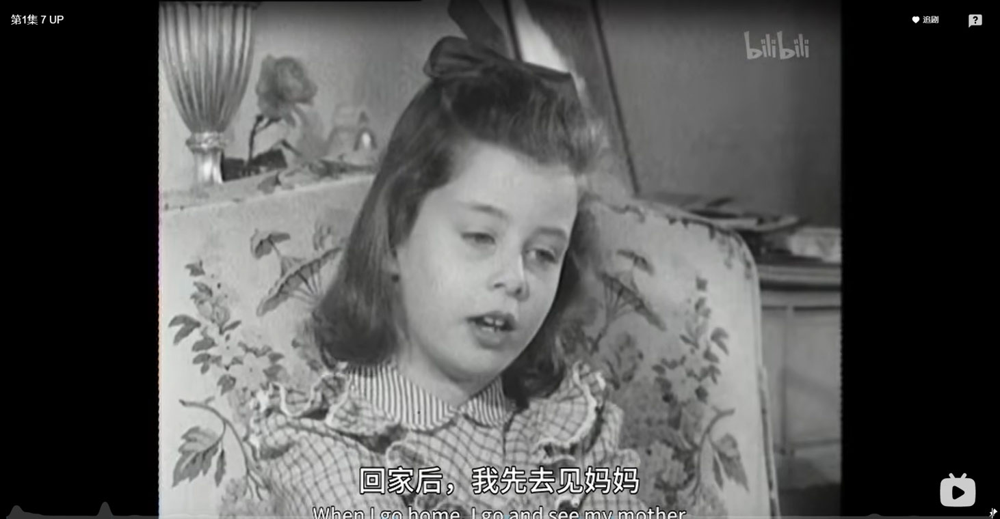

7岁：富家千金，生长环境优越，想上好的寄宿学校，觉得自己有可能上大学。

14岁：14岁时父母离异，迷茫、颓废。

21岁：16岁时辍学，跟随父母去巴黎读了几年书，父母离婚，对婚姻充满怀疑，抽烟。

28岁：Suzy爸爸去世，痛苦无比。结婚，老公自己创业，结婚并且生下了两个儿子，成为全职家庭主妇

35岁：生下一个女儿，家庭幸福美满。

42岁：Suzy在42岁时感慨，“我不想看到我的孩子像我一样一生碌碌无为，在年轻时应该有个目标或者一些值得为之努力的事情”

49岁：结婚27周年。儿子毕业后在伦敦生活。

56岁：大儿子和女儿都已上大学。Suzy说自己没有在事业上取得成功，但自己后来做了很多努力和尝试去改变，例如尽自己最大的努力照顾子女。

63岁：享受晚年的天伦之乐，幸福的婚姻后半辈子都过得挺幸福。

富家千金没想到也会辍学，也会迷茫，看来教育的方法很重要。

### 二、中产阶级

Peter彼得、 Neil尼尔、 Bruce布鲁斯

**Peter彼得（男）**

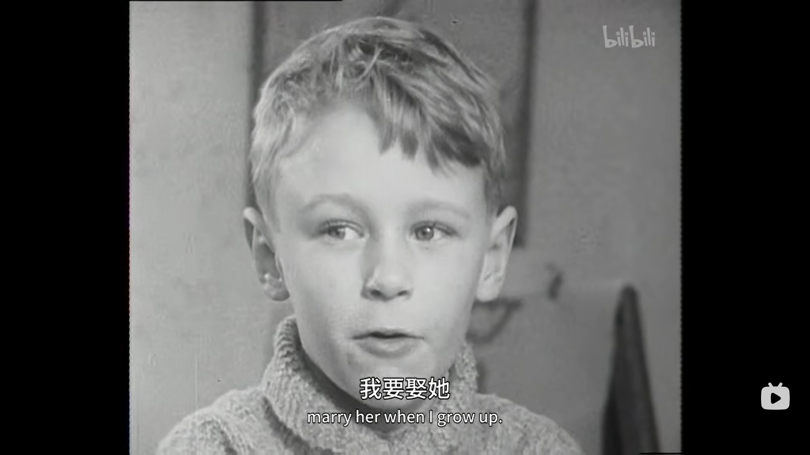

7岁：跟Neil是童年的伙伴，成长于利物浦郊区。

14岁：未参加节目录制。

21岁：在伦敦上大学，取得历史系文凭。

28岁：成为教师，表达了对[撒切尔](https://www.zhihu.com/search?q=撒切尔&search_source=Entity&hybrid_search_source=Entity&hybrid_search_extra={"sourceType"%3A"answer"%2C"sourceId"%3A936344989})政府的不满，显得有些愤世嫉俗，据说因此被屏蔽。

35岁~49：未参加节目录制。离开教育界，修读了法律，后来成为了公务员。

56岁：回归节目录制，Peter成立了自己的乐队，还获得了英国乡村音乐奖。儿子已经19岁读大一，女孩16岁。

63岁：儿子已经出来工作，女儿在伦敦读硕士。他自己继续经营他的乐队，每天有两天的正职工作，尝试写小说，他希望在生命的最后，不留太多的遗憾，能够创造出能延续下去的东西，让生命更有意义。

**Neil尼尔（男）**

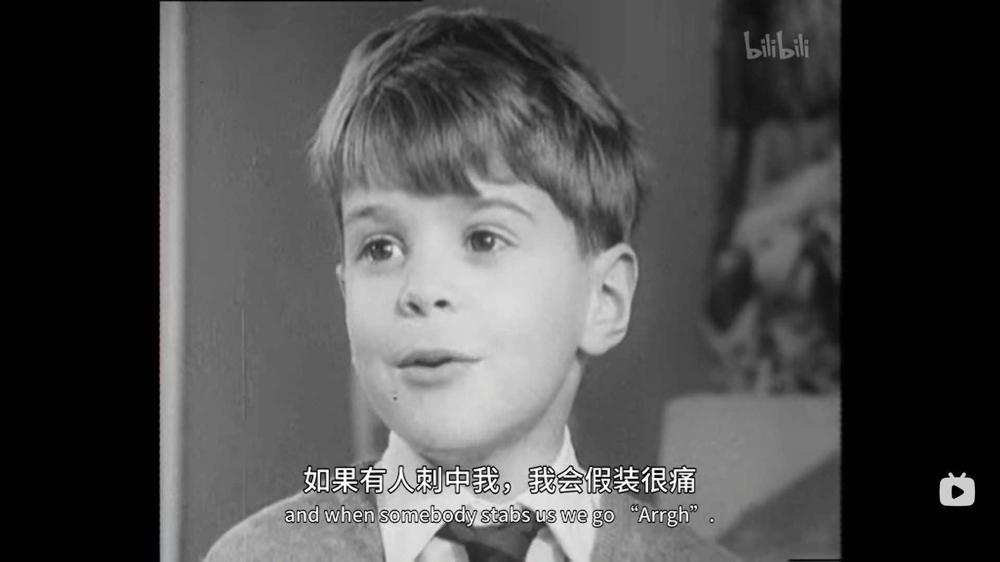

7岁：在利物浦郊区长大，父母是普通的中学老师，小时候的梦想是长大后成为宇航员。

14岁：在综合学校上中学。

21岁：曾梦想去牛津大学，后来没成功，去了阿伯丁大学，一个学期后辍学。在一个建筑工地工作，住在救济房里。

28岁：28岁无家可归，在苏格兰的西海岸流浪。

35岁：住在英国北部的某群岛的理事会庄园。

42岁：搬到伦敦，遇到了人生的贵人Bruce，在他的帮助下，成了Hackney议会中自由民主党的一员，开始从政，

49岁：离开伦敦，搬到[坎布里亚](https://www.zhihu.com/search?q=坎布里亚&search_source=Entity&hybrid_search_source=Entity&hybrid_search_extra={"sourceType"%3A"answer"%2C"sourceId"%3A936344989})，成为该区的一名议员，每月大概有200镑津贴，靠住房补助付房租，骑着自行车去拉票。没有结婚，也没有女朋友，他说这是他一生的遗憾。

56岁：在一个小地方当任民意代表，一生的政治生涯并不得志，

63岁：居然结婚了，但只维持了4年。继续从政，仍然表达对政府的不满。

Neil小时候跟爸爸关系不错，长大了觉得父亲的很多建议是错了，一直有隔阂。之前父亲去世前的最后时光，陪父亲在一起看板球赛时，有了一次较长的谈话，隔阂才消失了。可是父亲已经时日不多。

Neil与父亲的这种关系在现实生活中也是存在的，小时候可能因为父亲对自己的不理解，一直存在着隔阂，一生中与父亲相处的时间极少，直到父亲身体出了什么事情，才走得更近。所以趁还有时间，多花时间陪陪父母。

**Bruce布鲁斯（男）**

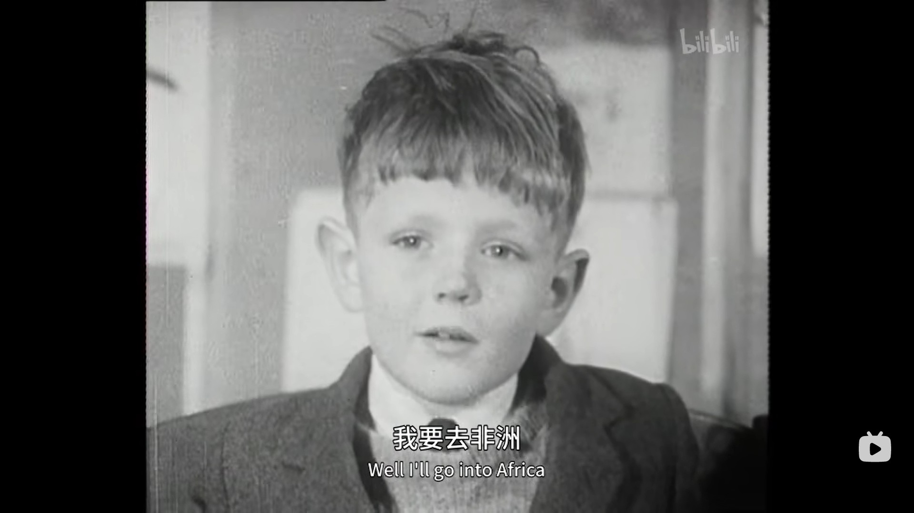

7岁：7岁去了预科寄宿学校，7岁就想去非洲教书，想要做[传教士](https://www.zhihu.com/search?q=传教士&search_source=Entity&hybrid_search_source=Entity&hybrid_search_extra={"sourceType"%3A"answer"%2C"sourceId"%3A936344989})的小天使，

14岁：14岁去伦敦上中学。

21岁：考上牛津，21岁时已是牛津大学数学系大四学生。

28岁：成为了一名教师。

35岁：去孟加拉国北部支教。

42岁：回到伦敦，在一所综合学院数字系当系主任。与一位教师结婚。育有两子。

49岁：49岁在圣奥尔本教书。

56岁：由于40多岁才结婚，Bruce56岁时儿子才在青春期，周末天气好的时候带着儿子去露营。

63岁：职业生涯基本结束。当他回首往事，幸福和婚姻生活，和拥有两个不错的孩子，不错的职业是他很骄傲的几件事情事情。

观众眼里的小天使，从小就是一个很有爱的小男孩，想着去非洲，给穷人传授知识，后来还曾帮助过正处于迷茫阶段的Neil。

在56UP那集，Bruce说很庆幸自己一生能当一个普通的数学教师。一生当个平凡的好人。如果这个世界多一个Bruce，就会多一份Love and peach。

### 三、底层阶级

Nick尼克(男)、Tony托尼(男)、Paul保罗(男)、Symon西蒙

**Nick尼克(男)**

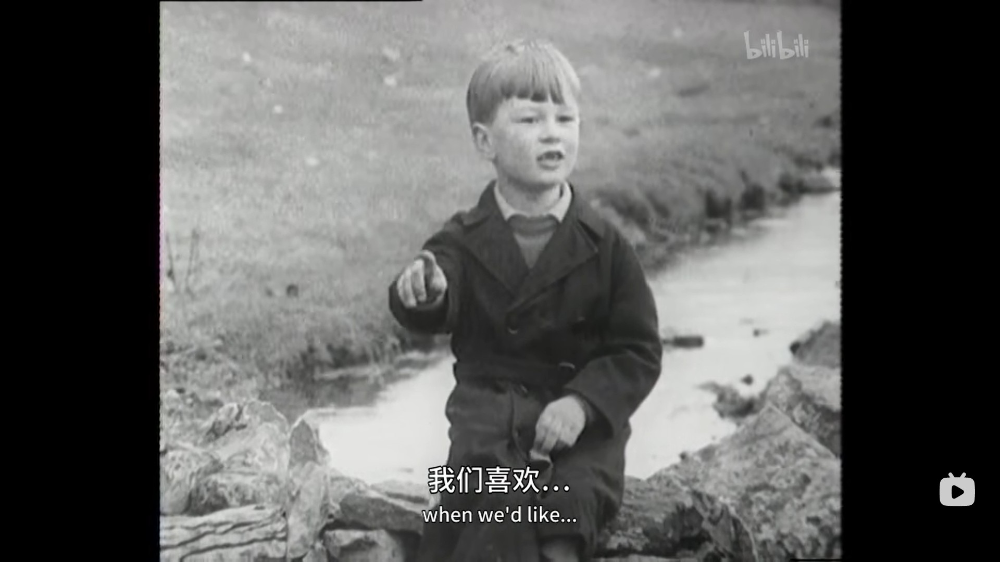

7岁：农民家庭（农场主儿子），性格非常内敛，父亲严格要求Nick学习，小学的上学环境很差，在一间只有一间教室的学校上学。

14岁：14岁离开农村去读住宿学校，对物理和化学很感兴趣。

21岁：考上牛津大学。

28岁：28岁前去美国[威斯康星州大学](https://www.zhihu.com/search?q=威斯康星州大学&search_source=Entity&hybrid_search_source=Entity&hybrid_search_extra={"sourceType"%3A"answer"%2C"sourceId"%3A936344989})做核聚变研究，在美国结婚，妻子是大学新闻系教授，育有一子。

35岁：35岁前成为副教授，院系副主席，出书，

42岁：成为正教授，目标是要在科学界出名。

49岁：孩子10岁。离婚后再婚。

56岁：继续与二妻幸福生活在一起，继续在大学当教授。

63岁：得了重病。

Nick是14个孩子中唯一一个成功跨向精英阶级的一位，Nick后来在节目中感谢他爸爸小时候逼他学习，逼他考名校。出生、家庭背景不能选择，但后天的努力是可以选择的，而Nick很幸运选了一条对的道路。

Nick的变化很大，7岁和14岁的节目中，可以看出来非常害羞，但是到了21岁，说话就变得非常的有自信，整个人都充满了魅力。

**Tony托尼(男)**

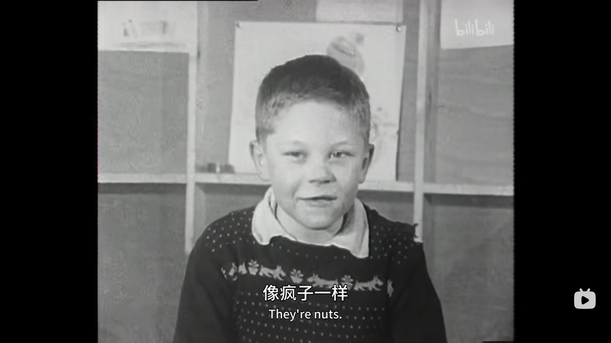

7岁：成长于伦敦东区，最底层的孩子，粗鲁、不懂礼貌、爱打架。小时候梦想当骑师。

14岁：14岁在马场当着学徒，15岁离开学校。

21岁：28岁放弃了赛马事业，改成当出租车司机，25岁父母双亡，非常爱爸妈。

28岁：有了自己的出租车，成为了出租车司机，与妻子两人日夜轮流开车，拥有三个孩子。自己学表演课，当跑龙套赚外快。

35岁：每年去西班牙度假一次，休闲时间还打打高尔夫。

42岁：婚姻不顺利。离开伦敦东区，搬到伍德福镇。

49岁：砸钱在西班牙买了栋度假别墅。儿子尼基是木材染色工人，女儿在邮局当邮差。Tony已是爷爷，过得挺幸福。2015年曾预言5年内经济会崩溃，结果2008年经济真的崩溃了。

56岁：仍在开计程车，但过着舒适的生活，去去西班牙的独家海边游玩，感觉很棒。觉得拥有三个孩子，还有很多孙子，自己的一生很幸福。曾经认为自己一生中最大的成就是与他的偶像在同一场赛马。

63岁：已有6个孙子，依旧在开出租车，近年来因为Uber的出现，对他们的收入有不小的影响。

Tony虽然是底层出生，但他一生都在奋斗，我想他是幸福的。

**Paul保罗(男)**

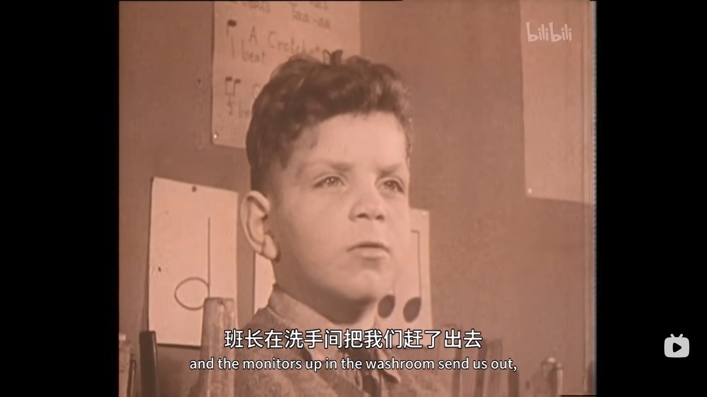

7岁：孤儿院里长大的孩子，父母离异，性格内敛，自卑。

14岁：上了一年寄宿学校，移民到澳大利亚，父亲再婚，和父亲继母住在[墨尔本市郊](https://www.zhihu.com/search?q=墨尔本市郊&search_source=Entity&hybrid_search_source=Entity&hybrid_search_extra={"sourceType"%3A"answer"%2C"sourceId"%3A936344989})。

21岁：21岁是砖瓦公司的初级工人，20来岁变卖房子买了辆房车跟妻子去环游澳洲。

28岁：28岁出去创业，成了包工头，已经有了两个小孩，

35岁：普通工人。

42岁：结婚20周年。42岁时在工厂工作，给塑料厂做标识，对工作的态度是活有得干就是了，老婆的工作是帮人剪头发，

49岁：老婆在养老院当医疗师，女儿是家族中唯一上大学的一位，他们很骄傲。儿子罗伯特在当汽车修理工。Paul已经当了爷爷。跟老婆的生活还算幸福，周末Paul去长跑，他妻子骑车跟在后面，跟他补给水。

56岁：跟老婆一起在养老院工作，当全修工。已经有好几个孙子。

63岁：现在已经有5个孙子，父亲大约4年前去世

导演问他父母离异对他的影响，他说唯一的影响大概是使他缺乏信心。

**Symon西蒙**

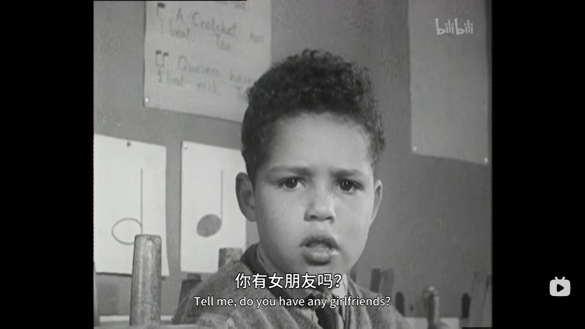

7岁：唯一的黑人男孩，私生子，单亲家庭，在福利院长大。

14岁：想要的东西很简单，也许是一辆单车，或者一只鱼竿。

21岁：在一家香肠冷冻库当工人。

28岁：普通工人。

35岁：31岁结婚生子，生了5个孩子，35岁离婚；35岁那年母亲患癌症去世。

42岁：42岁再婚，生有一子。

49岁：已有两个孙子。49岁，他与妻子去学习当寄养父母，希望给孩子更多的关爱。

56岁：未退休，仍在工作。和妻子在做着好事，照顾一些有困难的孩子。

63岁：总计照顾过130多个孩子，自己已有10个孙子。“越早了解你自己，就能越早知道自己能做什么”Paul说他自己用了60年多时间才明白自己是谁。

 ### 伦敦东区平民三姐妹

Sue苏、Jackie杰基、Lynn琳（普通工人家庭）

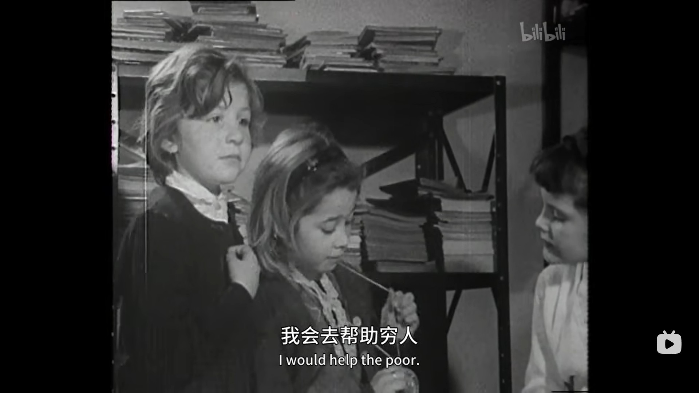

**Sue苏（女，右一）**

7岁：生长于伦敦东部的普通工人家庭，性格*开朗和洒脱。*

14岁：上综合学校。

21岁：21岁时在一家旅行社上班。

28岁：24岁结婚，丈夫是煤气装修工，育有两子了，住在伦敦的公租房；25岁*离婚了，步入单亲生活，各种兼职打零工。*

35岁：35岁离婚，兼职打工。

42岁：42岁时重新找到全职工作，在[伦敦大学](https://www.zhihu.com/search?q=伦敦大学&search_source=Entity&hybrid_search_source=Entity&hybrid_search_extra={"sourceType"%3A"answer"%2C"sourceId"%3A936344989})做协助课程管理的工作。同时再次找到真爱

49岁：49岁已是法学院系研究生项目主管理员，很享受自己的工作。和男朋友过得不错的生活。

56岁：两个孩子已经十岁多。自己虽然没读大学，但很幸运能在大学工作，谋得不错的职位，把家人照顾得不错。

63岁：与男朋友交往了20多年，但仍未正式结婚，对现状挺满意。很幸运，父母还健在，两个孩子也挺优秀。Sue一生都在工作，

**Jackie杰基（女，左一）**

7岁：生长于伦敦东部的普通工人家庭。

14岁：上综合学校。

21岁：19岁结婚，丈夫是油漆匠，住在伦敦市郊，生了一个孩子查理。

28岁：在保险公司工作，

35岁：30岁时妈妈去世。35岁离婚。后来遇到了艾恩，搬到了苏格兰，再生了两个孩子。

42岁：再次离婚，自己一人养了三个孩子，但她的婆婆一直在帮助她。

49岁：患有[风湿关节病](https://www.zhihu.com/search?q=风湿关节病&search_source=Entity&hybrid_search_source=Entity&hybrid_search_extra={"sourceType"%3A"answer"%2C"sourceId"%3A936344989})，*靠领救济金生活。节目在跟导演发火，不太想谈个人问题。导演问他想做的事情是什么，她说想回去学校学习。*

56岁：三个孩子已经长大成人。查理在附近一家餐馆做助理厨师，James在附近一家超市当警卫，生活仍然很不容易，前丈夫和婆婆都患了癌症。前夫在一次交通事故中去世。

63岁：已经有几个孙子，身体状况依然不太好，仍然靠政府的救济金生活。

**Lynn林恩（女，中间）**

7岁：生长于伦敦东部的普通工人家庭，理想是去沃尔沃斯超市上班。

14岁：去了文法学校上学（传统中学，主要提供大学预备课程），

21岁：19岁就结婚了，丈夫在邮局工作，有两个女儿，工作是在一个流动的儿童图书馆，负责孩子们的图书借阅

28岁：继续在流动儿童图书馆工作。

35岁：35岁父母去世，自己身体健康出了问题。

42岁：在伦敦东部某特殊图书馆工作，照顾有问题的儿童。两个女儿都没上大学，一个是某公司的安装协调员，另一个是饰品采购员。

49岁：结婚30周年，还在一起。已经当奶奶。仍然在图书馆照顾残疾儿童。

56岁：50多岁因为政府政策，被迫下岗，觉得政府很糟糕，搞得经济很萧条。孙子已经上了初中。

63岁：因为健康问题在58岁去世，她生前服务的图书馆为了纪念她，以她的名字命名了图书馆。

## 感想

-  **社会阶层确实在一定程度上决定了人一生的发展道路，但不是绝对的** 
-  **教育可能是唯一跨越社会阶级的梯子**
-  **辍学的代价是巨大的。** 
-  **不幸的婚姻对孩子的影响也许是一生的**。 

## 我的人生七年

当我看完这个纪录片之后，我就想到我的人生七年，我的起步阶段比起上边的这些人都要差，要定位到贫农，但我不抱怨出身，因为我有一个健康的身体已经很满足了。我特别要感谢我的家人没有放弃我的教育，而我自己也幸亏受到不知名力量（可能是我不喜欢干农活，因为家人老说，不上学就回家种地，所以，是因为懒吗？）的指引，没有过早辍学，要知道当时在我们那里，很多人连初中都没上完就辍学外出打工了，到了现在，好多曾经过早辍学的人，要么在工厂做普工，要么工作不稳定，随时可能失业。我能活成现在这样，基本上全靠教育，虽然我辜负它良多，我将以我拙劣的文字，来简要描述一下我的那些七年，并以此来砥砺自己前行。

### 七岁

2002年实在是太久远了，久远到当时的记忆都是模糊的，查阅历史可以知道，当时的中国才加入世贸组织，经济发展落后，互联网还是门户网站的天下，大家用的最多还是的电子邮箱和手机短信。

而在河南洛阳边界的一个偏远小山村，我正在一所小学读一年级，那个小学非常简陋，有一个院子，两个教室，一个老师，不过幸好，那个学校离家近，走路只需十几分钟便能到家。

那个时候生活条件不好，家里穷，天天喝的是玉米糁汤，吃的是放野菜的汤面条，啃的是玉米面馒头，对我来说，米饭、水果、方便面都算人间美味了，一年吃不了几次。我甚至忘了，那个时候家里到底有没有通电，在我的记忆里，我是经历过没电的生活的。

那时候的性格，我记得也不太清楚了，反正过得还挺开心的，有小伙伴经常一起玩耍，下学了不走正路，我们沿着河道走，掀螃蟹，摸鱼，上蹿下跳的，都是童年的美好回忆。

### 十四岁

2009了，此时的中国和世界刚刚经历了一个不平凡的一年，中国成功的举办了奥运会，汶川发生了百年不遇的大地震，美国次贷危机带崩了全球的经济，在新的一年里，中国互联网的格局也在发生巨变，腾讯的QQ注册账号已经达到9点多亿，市值达到全球第三大互联网公司，阿里巴巴在这一年创造了双十一活动，平台销量突飞猛进，而百度，因为谷歌退出中国大陆，一跃成为中国第一的搜索引擎，从此BAT格局形成。

上面发生的那些大事，我好像只知道一个北京奥运会，以及正在流行的非主流，那时正上初二，寄宿在中学，双耳不闻校外事，也没有什么上网工具，最多会偷偷的看一些课外书，正是那段时间我迷上了玄幻武侠小说，最早看的书就是唐家三少写的。我想，正是因为这段时间的懈怠，我开始与之前一块起早贪黑背书的好朋友渐行渐远，在学习方面，我只能看到他们的背影，以至于后来没有考上心仪的高中乃至大学，说明我的自制力还是有些问题的。

我那时的性格已经是内向了，看到女生会比较害羞，上课不敢举手，害怕老师提问，害怕当着众人演讲，调位置喜欢坐在靠墙的角落，事实证明有很多和我一样的人，因为大家都爱躲着老师。不知道从什么时候开始，很多大人都会说我很腼腆，说的多了，我就给自己贴了一个标签——腼腆，做什么事都会往上边靠一靠，仿佛这是自己与生俱来的属性。

生活上倒是好了很多，一周生活费30块钱左右，在学校吃饭是够的，甚至还能偶尔出去学校买个早餐，物价相比现在真是天壤之别。那段时间因为备战中招考试，也爱上了打篮球，和朋友打球玩的废寝忘食，我觉得自己最快乐的时光仿佛永远留在了初中，往后的日子多了很多令人烦恼的东西。

### 二十一岁

时间来到了2016年，中国的经济迅猛发展，GDP已经排到世界第二，令美国不得不重视的地步。互联网公司还在野蛮生长，相互之间竞争激烈，外卖砸钱，共享单车砸钱，但却实打实的造福广大用户，方便了支付，方便了出行，丰富了生活，出门基本上只需要带一部智能手机即可无忧。大城市的高房价已经让年轻人越来越看不到希望。

本该读大三的我，却因为一次可有可无的复读，在一所普通三本院校读大二，说到这里就有些羞愧，我复读之前是三本，复读完还是，从此背着一年八千块的贷款和家里的辛苦支持，选择上了三本而非大专，不过那可能是我当时最正确的决定了。

当时我的状态是很迷茫的，因为我发现我不喜欢自己的专业，我之所以选择这个专业(电气工程及其自动化)，是我基于自身的性格考量的，以及自身的一些经历，因为高考完之后我和同学们去了电子厂打工，学生工当然都是廉价的普工了，那时觉得普工地位好低啊，经常受领导的骂，而且一直重复劳动毫无意义，反而觉得当技术员是一件美事，对于不太会说话，又内向的自己，还挺合适，于是经过网上查询和老师的推荐，报了这个专业，现在想来，还挺后悔的，无奈当时的自己认知有限，别无选择。

大二还是迷茫，迷茫未来真的要进工厂吗？为何有此疑问，因为自己借助网络平台了解到了互联网行业、黑客、人工智能，感觉那样的人，厉害又神秘，原来大家一直用的软件、网页，都是这些人搞出来的，当然他们的待遇也很优厚，这对于一个来自山村穷小子来说无疑有很大的诱惑，真的很想转行做这个，但苦于无人指导，无法入门，于是我每天都在网上搜啊搜，想知道一些有用的信息，这多亏了互联网的普及，在知乎上了解到了很多的信息，于是我大二一年啃了一本600多页的C语言入门书，慢慢的，对于本专业学的其他知识，都没什么兴趣了，随着我后续对互联网行业的更加了解，导致了我确定了未来的职业选择，职业目标愈来愈清晰。

这一年不仅对我的职业规划很有意义，对我的情感生活也是如此，没记错的话，在这一年，我谈了一个对象，一个高中的同学，一个很懂事很顾家的女孩，我们在同一个城市，不同的学校，在一起虽然会有很多不开心的事，但也有好的回忆，可惜，未能携手走多远，终成过客。

我的性格变得没有以前开朗了，其实这个从高中时候就开始了，初中时我虽然内向，但是真的很爱笑，笑点很低的那种，现在却整天为感情焦虑，为未来焦虑。

### 待续

已经工作了三年，明年就二十八岁了，到时候会继续更新......
